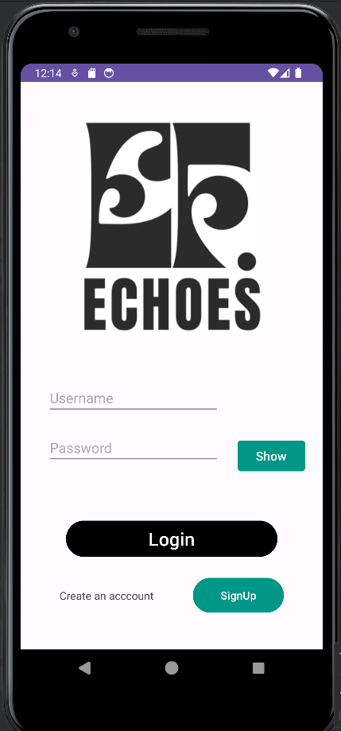
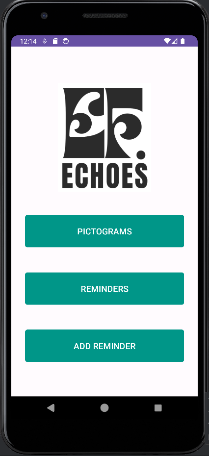
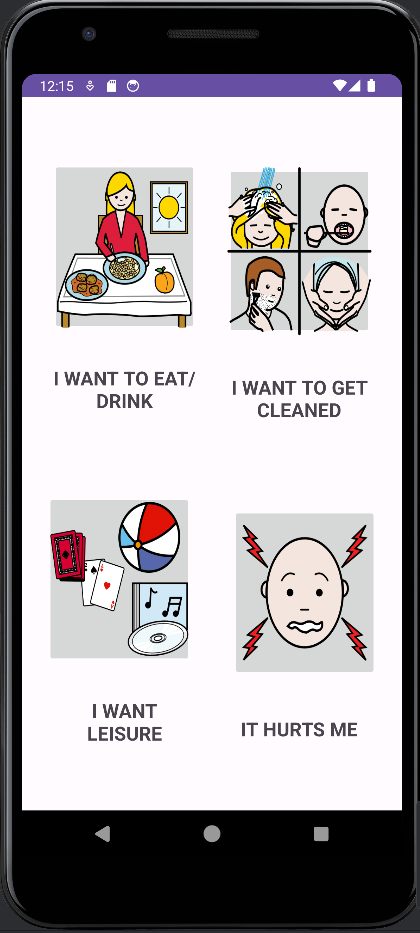
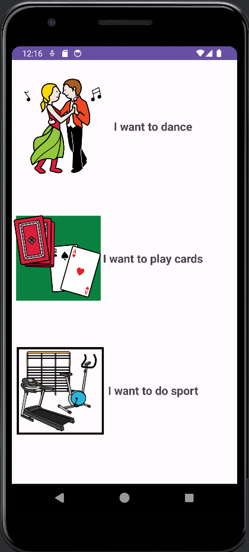
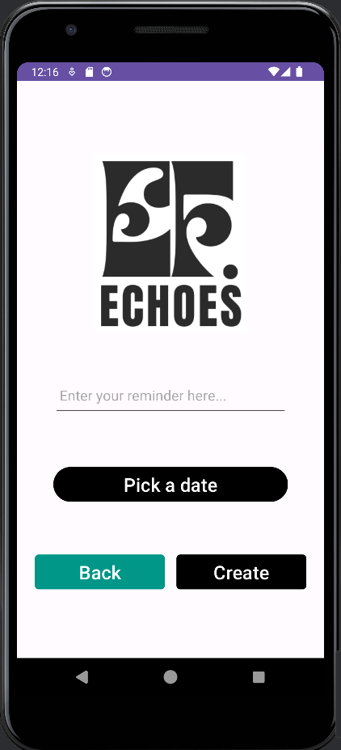
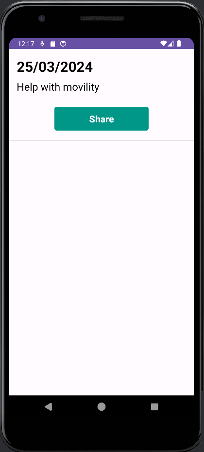
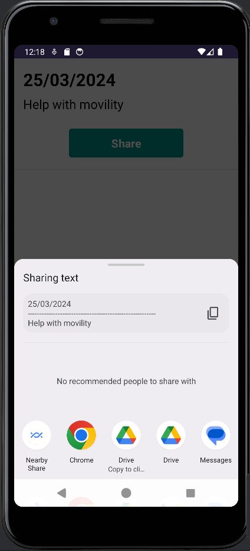

# EchoesApp
App de comunicación vía Pictogramas para Android. EchoesApp es un proyecto desarrollado para el programa de intercambio EMEU CROSSOVER de Erasmus entre el centro Uni Eibar/Ermua y Horizon College. La aplicación se ideo para facilitar la comunicacion entre usuarios y cuidadores en contextos de residencias de tercera edad o centros similares. Se fijo como target group a aquellas personas que muestran dificultades con la comunicación oral. La aplicación se desarrollo usando Android Studio y mediante el uso de Java y implementando una base de datos de Room (instancia de SQLIte) y una api de text to speech. La aplicación se puede usar en cuatro idiomas diferentes; español, euskera, inglés y holandés. Se fijara el idioma automaticamente segun el idioma principal que esta fijado en el dispositivo donde se instale.

## Guia Basica

El programa tiene un sistema de acceso de usuarios añadiendo una pequeña capa de seguridad y permitiendo al usuario procesar sus propios datos. Al iniciar el programa se mostrara el login, si no se ha creado una cuenta se debera de crear una para acceder.

Una vez que se ha accedido se mostrara el menu principal, el programa tiene dos funcionalidades principales. Siendo la primera de ellas el poder interactuar con pictogramas, y siendo la segunda la posibilidad de añadir recordatorios, eliminarlos, visualizarlos y compartirlos.

Si accedemos a los pictogramas veremos que se dividen en cuatro categorias, cada categoria dispone de sus propios pictogramas. El usuario podra elegir la categoria deseada dependiendo de la necesidad que manifiesta. Al acceder a una categoria se listaran los pictogramas, a partir de ahi el usuario podra presionar en uno y mediante un text to speech se reproducira el pictograma facilitando la comunicación y manifestando la necesidad.

Por ultimo, los recordatorios se podran añadir o mostrar accediendo a su correspondiente sección desde el menu principal. Si accedemos a añadir recordatorio se mostrará un pequeño formulario pidiendo insertar el recordatorio y la fecha, para insertar la fecha se abrira un calendario para fijar el dia deseado. Una vez se añade el recordatorio se pueden ver los recordatorios entrando en la sección de recordatorios. Una vez accediendo a los recordatorios se listaran todos en formato de lista, se puede compartir el recordatorio presionando el boton de compartir o eliminarlo deslizando el recordatorio hacia la izquierda o derecha.

